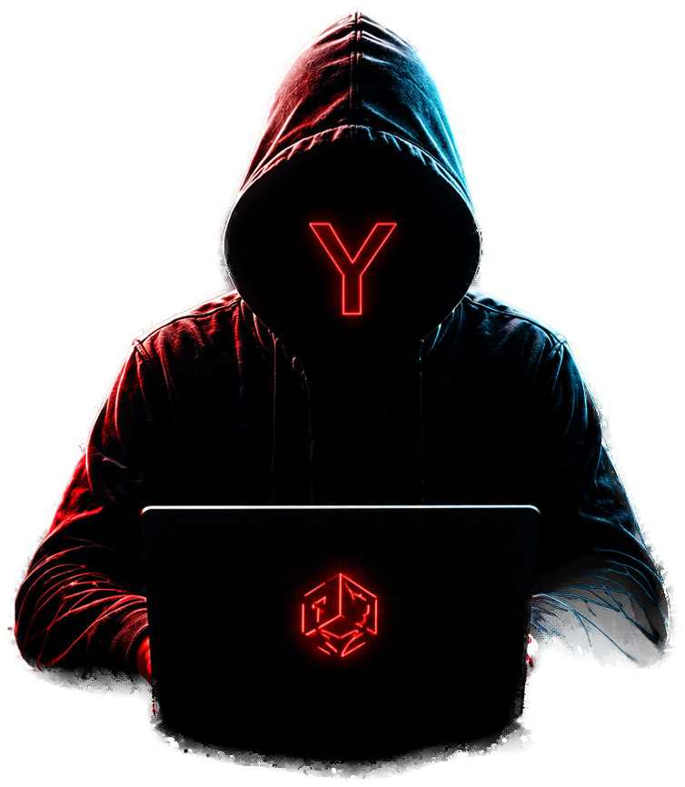

<div align="center">




### 

[](https://github.com/Yaman-RedTeam/Portfolio)
[](https://youtube.com/@yamanredteam)
[](https://www.linkedin.com/in/yaman-redteam/)
[](https://www.instagram.com/yaman.redteam)
[](https://tryhackme.com/p/YamanRedTeam)


</div>

---

## 📡 About

A cyberpunk-themed personal portfolio for **Yaman** — an offensive security specialist, red team enthusiast, and cybersecurity content creator. Built as a fully interactive single-page site: 3D globe hero, live-fetched YouTube videos, animated skill bars, scrolling certificate walls, and a real-time "Cyber Command Center" dashboard.

> I specialize in **AI-powered Offensive Security**, **Red Team Operations**, **Web & API Penetration Testing**, **Active Directory Security**, and **Enterprise Attack Simulation** — building AI-driven offensive workflows and performing realistic security assessments on modern enterprise environments.

---

## ✨ Features

| | |
|---|---|
| 🌍 **3D Interactive Hero** | WebGL particle globe + Earth render behind an animated hacker figure |
| 🛡️ **CyberWarFare Certificates** | Scrolling marquee of verified certifications with PDF viewers |
| 📜 **Other Certificates** | 15+ additional certs (Excel, MERN, Cloud, Bug Bounty, TryHackMe, and more) |
| 🧪 **Projects & Internships** | Real VAPT engagements, phishing simulations, and technical assessments — with GitHub repos and full reports |
| 🎥 **Live YouTube Feed** | Auto-fetches real videos straight from the channel (no API key) — Shorts and course content filtered out automatically |
| 🎙️ **Webinar Certificates** | Framed wall of speaking/attendance certificates |
| ⚔️ **Skills Arsenal** | Animated proficiency bars across pentesting tools & methodologies |
| 📈 **Career Timeline** | Vertical animated experience log |
| 🖥️ **Cyber Command Center** | Live clock, radar sweep, mock threat dashboard |
| 📬 **Contact Form** | Netlify Forms-powered, no backend required |

---

## 🧰 Tech Stack

<div align="center">


</div>

- **[Next.js 16](https://nextjs.org/)** (App Router, Turbopack) — React framework
- **[React Three Fiber](https://docs.pmnd.rs/react-three-fiber)** + **Three.js** — the WebGL hero globe
- **[Framer Motion](https://www.framer.com/motion/)** — scroll-triggered animations throughout
- **[Tailwind CSS 4](https://tailwindcss.com/)** — utility-first styling, cyberpunk theme tokens
- **[Lucide](https://lucide.dev/) + [React Icons](https://react-icons.github.io/react-icons/)** — iconography (including official brand marks)
- **YouTube scraping (no API key)** — server-side fetch of the channel's real upload list

---

## 🚀 Getting Started

```bash
# clone the repo
git clone https://github.com/Yaman-RedTeam/Portfolio.git
cd Portfolio

# install dependencies
npm install

# run the dev server
npm run dev
```

Open [http://localhost:3000](http://localhost:3000) to view it.

```bash
npm run build   # production build
npm run start   # serve the production build
npm run lint    # eslint
```

---

## 📁 Project Structure

```
├── src/
│   ├── app/                 # Next.js App Router entry, layout, global styles
│   ├── components/
│   │   ├── sections/        # Hero, About, Certifications, Skills, Projects, Videos, Experience, Contact...
│   │   ├── ui/               # Reusable pieces — Marquee, Modal, Counter, SocialIcon, VideoGallery...
│   │   └── layout/           # Navbar, Footer
│   └── lib/                  # YouTube channel scraper/fetcher
├── data/                     # Content as JSON — profile, skills, projects, certificates, socials...
└── public/                   # Images, certificate PDFs, resume, reports
```

Content (certifications, skills, projects, videos, timeline) is data-driven from the JSON files in `data/` — no hardcoded copy inside components.

---

## 📫 Connect

<div align="center">

[](https://youtube.com/@yamanredteam)
[](https://www.linkedin.com/in/yaman-redteam/)
[](https://www.instagram.com/yaman.redteam)
[](https://github.com/Yaman-RedTeam)
[](https://tryhackme.com/p/YamanRedTeam)

</div>

---

<div align="center">


*Security isn't optional — it's the frontline of digital trust.*

</div>
